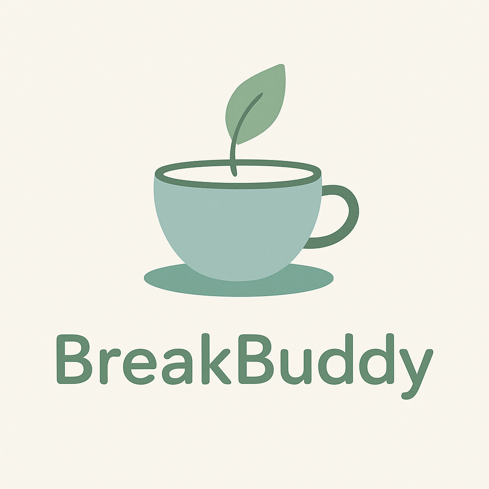

<a id="readme-top"></a>
[![Contributors][contributors-shield]][contributors-url]
[![Forks][forks-shield]][forks-url]
[![Stargazers][stars-shield]][stars-url]
[![Issues][issues-shield]][issues-url]
[![project_license][license-shield]][license-url]
[![LinkedIn][linkedin-shield]][linkedin-url]

 <br />
<div align="center">
  <a href="https://github.com/cali-li/BreakBuddy">
    
  </a>

<h3 align="center">BreakBuddy - Break Time Reminder App</h3>

  <p align="center">
    project_description
    <br />
    <a href="https://github.com/cali-li/BreakBuddy/blob/master/doc/doc_readme.md"><strong>Explore the docs »</strong></a>
    <br />
    <br />
    <a href="https://github.com/cali-li/BreakBuddy/blob/master/doc/doc_readme.md">View Demo</a>
    &middot;
    <a href="https://github.com/cali-li/BreakBuddy/issues/new?labels=bug&template=bug-report---.md">Report Bug</a>
    &middot;
    <a href="https://github.com/cali-li/BreakBuddy/issues/new?labels=enhancement&template=feature-request---.md">Request Feature</a>
  </p>
</div>
<!-- TABLE OF CONTENTS -->
<details>
  <summary>Table of Contents</summary>
  <ol>
    <li>
      <a href="#about-the-project">About The Project</a>
      <ul>
        <li><a href="#built-with">Built With</a></li>
      </ul>
    </li>
    <li>
      <a href="#getting-started">Getting Started</a>
      <ul>
        <li><a href="#prerequisites">Prerequisites</a></li>
        <li><a href="#installation">Installation</a></li>
      </ul>
    </li>
    <li><a href="#how-it-works">How It Works</a></li>
    <li><a href="#file-structure">File Structure</a></li>
    <li><a href="#roadmap">Roadmap</a></li>
    <li><a href="#contributing">Contributing</a></li>
    <li><a href="#license">License</a></li>
    <li><a href="#contact">Contact</a></li>
    <li><a href="#acknowledgments">Acknowledgments</a></li>
  </ol>
</details>


## About The Project
[![Product Name Screen Shot][product-screenshot]](https://github.com/cali-li/BreakBuddy/doc/screenshot.png)

A friendly Electron app that reminds you to take healthy breaks during your work sessions.

**Update:**

- v1.0.2: fixed the issue with minimize the app. force the window to be on top of the screen during resting phase.

<p align="right">(<a href="#readme-top">back to top</a>)</p>


### Built With

* [![Electron][Electron.js]][Electron.url]
* [![Node][Node.js]][Node.url]
* [![HTML/CSS/JS][HTML/CSS/JavaScript]][html.url]
* [![electronstore][electronstore]][electronstore.url]
* [![playsound1][playsound]][playsound.url]
* [![electronbuilder1][electronbuilder]][electronbuild.url]

<p align="right">(<a href="#readme-top">back to top</a>)</p>


## Getting Started

Instructions on setting up the project locally.
To get a local copy up and running follow these simple example steps.

### Prerequisites

- Node.js (version 14 or higher)

- npm (comes with Node.js)

### Installation

1. **Clone the repo**
   ```sh
   git clone https://github.com/cali-li/BreakBuddy.git
   ```

2. **Install Dependencies**:

   ```bash

   npm install

   ```

 
3. **Run the App**:

   ```bash

   # Main app (45 min work, 5 min rest)

   npm start

  

   # Demo mode (6 seconds each)

   npm run demo


   ```

 
4. Change git remote url to avoid accidental pushes to base project

<p align="right">(<a href="#readme-top">back to top</a>)</p>


<!-- USAGE EXAMPLES -->
## How It Works

1. **Work Session**: Set your work duration and start the timer

2. **First Reminder**: When work time ends, you get a friendly reminder

3. **Second Reminder**: If you continue working, you get another reminder

4. **Screen Protector**: After 2 reminders, BreakBuddy forces you to rest

5. **Rest Session**: Take your break while the screen protector is active

6. **Repeat**: After rest time, you're back to work!


<p align="right">(<a href="#readme-top">back to top</a>)</p>


## File Structure


```

break-buddy/

├── src/

│   ├── main.js              # Main Electron process

│   ├── index.html           # Main app UI

│   ├── renderer.js          # Main app logic

│   ├── styles.css           # Main app styling

│   ├── reminder.html        # Reminder popup UI

│   ├── reminder.js          # Reminder logic

│   ├── reminder-styles.css  # Reminder styling

│   ├── screen-protector.html # Screen protector UI

│   ├── screen-protector.js  # Screen protector logic

│   └── screen-protector-styles.css # Screen protector styling

├── clock_chime/             # Sound files (optional)

│   ├── work_time_is_up.mp3

│   └── rest_time_is_up.mp3

├── demo.js                  # Demo version (6-second timers)

├── test-quick.js           # Quick test version (1-minute timers)

├── package.json            # Dependencies and scripts

└── README.md              # This file

```


<!-- ROADMAP -->
## Roadmap
- [ ] Add logo
- [ ] Fix the test-quick.js to enable a new set of test
- [ ] Enable Spotify in app
- [ ] Add focused time calculator
    - [ ] Detect the actual working time. Reset the clock if the end user doesn't actively work.

See the [open issues](https://github.com/cali-li/BreakBuddy/issues) for a full list of proposed features (and known issues).

<p align="right">(<a href="#readme-top">back to top</a>)</p>


<!-- CONTRIBUTING -->
## Contributing

Contributions are what make the open source community such an amazing place to learn, inspire, and create. Any contributions you make are **greatly appreciated**.

If you have a suggestion that would make this better, please fork the repo and create a pull request. You can also simply open an issue with the tag "enhancement".
Don't forget to give the project a star! Thanks again!

1. Fork the Project
2. Create your Feature Branch (`git checkout -b feature/AmazingFeature`)
3. Commit your Changes (`git commit -m 'Add some AmazingFeature'`)
4. Push to the Branch (`git push origin feature/AmazingFeature`)
5. Open a Pull Request

<p align="right">(<a href="#readme-top">back to top</a>)</p>

### Top contributors:

<!-- <a href="https://github.com/github_username/repo_name/graphs/contributors">
  
</a> -->


<!-- LICENSE -->
## License

Distributed under the project_license. See `LICENSE.txt` for more information.

<p align="right">(<a href="#readme-top">back to top</a>)</p>


<!-- CONTACT -->
## Contact

Cali Li - [@github_handle](https://github.com/cali-li) 

Project Link: [https://github.com/cali-li/BreakBuddy](https://github.com/cali-li/BreakBuddy)

<p align="right">(<a href="#readme-top">back to top</a>)</p>


<!-- ACKNOWLEDGMENTS -->
## Acknowledgments

* []()
* []()
* []()

<p align="right">(<a href="#readme-top">back to top</a>)</p>


<!-- MARKDOWN LINKS & IMAGES -->
<!-- https://www.markdownguide.org/basic-syntax/#reference-style-links -->
[contributors-shield]: https://img.shields.io/github/contributors/cali-li/BreakBuddy.svg?style=for-the-badge
[contributors-url]: https://github.com/cali-li/BreakBuddy/graphs/contributors
[forks-shield]: https://img.shields.io/github/forks/cali-li/BreakBuddy.svg?style=for-the-badge
[forks-url]: https://github.com/cali-li/BreakBuddy/network/members
[stars-shield]: https://img.shields.io/github/stars/cali-li/BreakBuddy.svg?style=for-the-badge
[stars-url]: https://github.com/cali-li/BreakBuddy/stargazers
[issues-shield]: https://img.shields.io/github/issues/cali-li/BreakBuddy.svg?style=for-the-badge
[issues-url]: https://github.com/cali-li/BreakBuddy/issues
[license-shield]: https://img.shields.io/github/license/cali-li/BreakBuddy.svg?style=for-the-badge
[license-url]: https://github.com/cali-li/BreakBuddy/blob/master/LICENSE.txt
[linkedin-shield]: https://img.shields.io/badge/-LinkedIn-black.svg?style=for-the-badge&logo=linkedin&colorB=555
[linkedin-url]: https://linkedin.com/in/cali-li
[product-screenshot]: doc/screenshot.png
[Electron.js]: https://img.shields.io/badge/Electron.js-000000?style=for-the-badge&logo=electron&logoColor=#47848F
[Electron.url]: https://www.electronjs.org/
[Node.js]: https://img.shields.io/badge/Node.js-000000?style=for-the-badge&logo=nodedotjs&logoColor=#5FA04E
[Node.url]: https://nodejs.org/
[HTML/CSS/JavaScript]: https://img.shields.io/badge/HTML/CSS/JavaScript-000000?style=for-the-badge&logo=html5&logoColor=#E34F26
[html.url]: https://developer.mozilla.org/
[electronstore]: https://img.shields.io/badge/electronstore-000000?style=for-the-badge&logo=github&logoColor=#181717
[electronstore.url]: https://github.com/sindresorhus/electron-store
[playsound]: https://img.shields.io/badge/playsound-000000?style=for-the-badge&logo=github&logoColor=#181717
[playsound.url]: https://github.com/shime/play-sound
[electronbuilder]: https://img.shields.io/badge/electronbuilder-000000?style=for-the-badge&logo=electronbuilder&logoColor=##000000
[electronbuild.url]: https://www.electron.build/

[React.js]: https://img.shields.io/badge/React-20232A?style=for-the-badge&logo=react&logoColor=61DAFB
[React-url]: https://reactjs.org/
[Vue.js]: https://img.shields.io/badge/Vue.js-35495E?style=for-the-badge&logo=vuedotjs&logoColor=4FC08D
[Vue-url]: https://vuejs.org/
[Angular.io]: https://img.shields.io/badge/Angular-DD0031?style=for-the-badge&logo=angular&logoColor=white
[Angular-url]: https://angular.io/
[Svelte.dev]: https://img.shields.io/badge/Svelte-4A4A55?style=for-the-badge&logo=svelte&logoColor=FF3E00
[Svelte-url]: https://svelte.dev/
[Laravel.com]: https://img.shields.io/badge/Laravel-FF2D20?style=for-the-badge&logo=laravel&logoColor=white
[Laravel-url]: https://laravel.com
[Bootstrap.com]: https://img.shields.io/badge/Bootstrap-563D7C?style=for-the-badge&logo=bootstrap&logoColor=white
[Bootstrap-url]: https://getbootstrap.com
[JQuery.com]: https://img.shields.io/badge/jQuery-0769AD?style=for-the-badge&logo=jquery&logoColor=white
[JQuery-url]: https://jquery.com 
